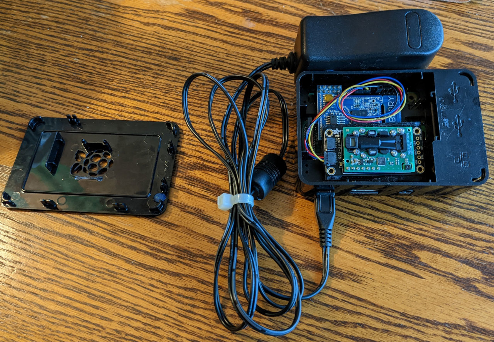

# exhale: software-defined fresh air
Ventilating your home keeps the air fresh, but too much ventilation wastes energy.

This project controls a bathroom vent fan using a Z-wave smart switch, providing "just enough" ventilation to maintain a target CO₂ level. The code runs on a Raspberry Pi with no network access and a read-only filesystem.

## Hardware I'm using
- UltraPro Z-Wave Plus toggle switch
- Raspberry Pi 3 B+ (TODO: experiment with "Le Potato" AML-S905X-CC)
- Adafruit SCD-30 CO2 sensor + STEMMA QT with female sockets
- Z-Wave.Me RaZberry2 (also tested with HUSBZ-1 USB Z-wave controller)
- CanaKit Premium Black Case
- CanaKit MicroUSB power supply

## Software installation
- Burn Raspberry Pi OS Lite to an SD card
- Configure WiFi and/or SSH if desired
- Install random stuff:
  ```shell
  sudo apt install -y git screen python3-pip
  pip3 install adafruit-circuitpython-scd30 adafruit-extended-bus
  ```
- Apparently python-openzwave 0.4.19 doesn't install on RPiOS 11, so perhaps it was a bad idea to depend on this library, but for now it's still buildable:

  ```shell
  sudo apt install -y cython3 libopenzwave1.6-dev
  git clone https://github.com/OpenZWave/python-openzwave.git
  cd python-openzwave
  sed -i 's/Cython==0.28.6/Cython>=0.29/' pyozw_setup.py
  ./setup-lib.py install --user --flavor=shared
  ```

- Configure GPIO pins:
  ```
  # /dev/ttyS0 (zwave controller) on GPIO 2-3:
  sudo raspi-config nonint do_serial 2
  # /dev/i2c-6 (scd30) on GPIO 9-10:
  sudo raspi-config nonint do_i2c 0
  echo 'dtoverlay=i2c-gpio,bus=6,i2c_gpio_scl=9,i2c_gpio_sda=10' | sudo tee -a /boot/config.txt
  ```

- Make `./exhale.py reset` work, followed by `./exhale.py co2`:
  ```
  $ git clone https://github.com/pmarks-net/exhale.git
  $ cd exhale
  $ ./exhale.py --help
  === subcommand 'reset' ===
  usage: exhale.py reset [-h] --zdevice /dev/ttyX --switches N

  Reinitialize the ZWave network. Before running this command, all switches must
  be in the 'factory reset' state. To factory reset an UltraPro Z-Wave toggle
  switch, quickly press 'up up up down down down'. Later when prompted, press
  'up' to add each switch to the ZWave network.

  optional arguments:
    -h, --help           show this help message and exit
    --zdevice /dev/ttyX  ZWave serial device
    --switches N         Number of switches to add

  === subcommand 'co2' ===
  usage: exhale.py co2 [-h] --zdevice /dev/ttyX [--scd30_i2c 6]
                       [--co2_limit 800] [--co2_diff 50] [--manual 3600]

  Run the daemon to monitor CO₂ levels and control exhaust fans.

  optional arguments:
    -h, --help           show this help message and exit
    --zdevice /dev/ttyX  ZWave serial device
    --scd30_i2c 6        Read from SCD30 at /dev/i2c-N; requires (e.g.)
                         dtoverlay=i2c-gpio,bus=6,i2c_gpio_scl=9,i2c_gpio_sda=10
    --co2_limit 800      Enable fan when CO₂ level exceeds this ppm value
    --co2_diff 50        Disable fan when CO₂ level falls below (limit-diff)
    --manual 3600        When a switch is toggled manually, disable automatic
                         control for this many seconds
  ```

- Add stuff to `/etc/rc.local`:
  ```shell
  # The LED blinker won't work without this:
  chmod a+w /sys/class/leds/led1/brightness
  # Use `screen -r` to see logs and debug:
  su pi -c "/home/pi/exhale/daemon.sh"
  ```

- Enable overlay file system, for read-only SD card: https://learn.adafruit.com/read-only-raspberry-pi

## Photos
- Attach the RaZberry and SCD30 as shown; insulate behind the SCD30 with electrical tape:  
    
- Everything fits in the case when positioned like this:
  
- The only building modification is a Z-wave smart switch controlling the bathroom vent fan:  
  
- Hot glue the RPi case to a power supply for wall mounting, somewhere within range of the z-wave switch:  
  
- To see the red LED (faintly), drill a hole in the lid and fill with hot glue. Here it is blinking 8 times for >=800 ppm. Every fifth blink is slower:  
  
